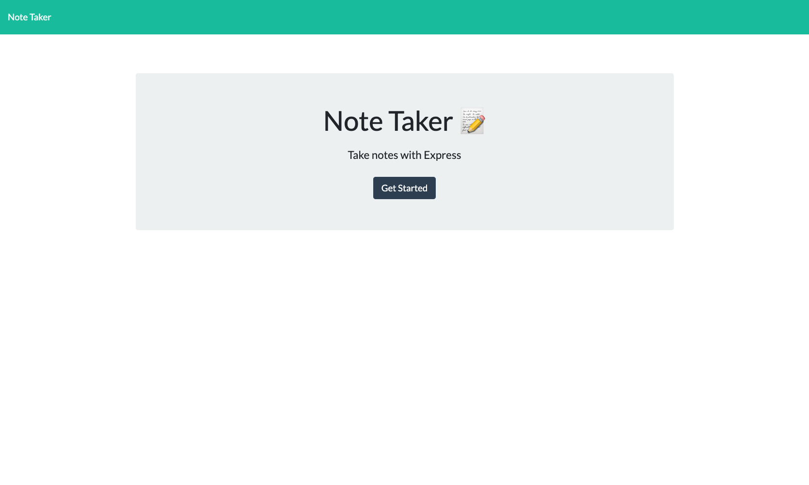

# Note-Taker 
  ## Table of Contents:
  1. [Description](#description) 
  2. [Installation](#installation)
  3. [Usage](#usage)  
  4. [Contributing](#contribution)
  5. [Tests](#test)
  6. [License](#license)
  7. [GitHub](#github)
  8. [E-mail](#e-mail)
## Description
Simple app for taking and saving notes.  Uses node.js and express and has a fully functional front and backend. Notes are saved via the save button, a note can be discarded and written again with the + button, and deleted with the trash  button.  
## Installation
Download the full github repository and run the server using the apps express.js backend on your local machine, or simply use the deployed heroku link. 
## Usage

## Contribution
Send any push requests you want
## Test
Visit the deployed heroku link 
## License
This Project is Unlicensed. None
## GitHub
https://github.com/DeviousDoge/note_taker
## E-mail
pdillon0@gmail.com
